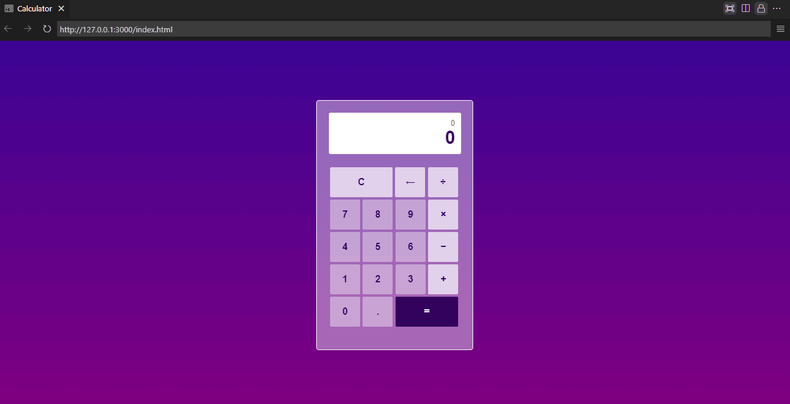

# vanilla-js-calculator
A simple calculator project built using vanilla JS.

The calculator allows users to perform basic arithmetic operations such as addition, subtraction, multiplication, and division.

# 🏅 Acknowledgements
This project was inspired by my desire to strengthen my JavaScript skills and gain hands-on experience with DOM manipulation and event handling.

# 📷 Display

🔗 Try it out: https://ivanreeve.github.io/vanilla-js-calculator/
